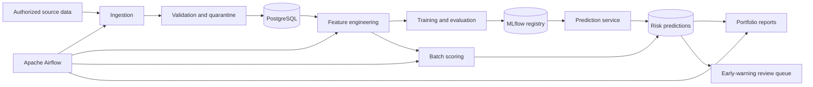

# System Architecture

## Purpose

The system converts authorized customer, loan, repayment, and account data into
validated analytical records, default-risk estimates, early-warning indicators,
and portfolio reports. Each component has a narrow responsibility so ingestion,
modeling, serving, and reporting can be tested independently.

## High-level flow

## Components

### Data ingestion

The ingestion layer reads source files or approved upstream extracts, preserves
raw inputs, standardizes identifiers and dates, and records processing metadata.
It never silently discards rejected rows.

### Validation and PostgreSQL

Validation checks required fields, valid ranges, keys, duplicates, and temporal
consistency. Accepted records are loaded into PostgreSQL; rejected records are
quarantined with a reason. Versioned SQL scripts define the schema and indexes.

### Feature engineering

Reusable transformations produce income, leverage, repayment-delay, missed-
payment, utilization, and account-activity features. Every feature is calculated
as of the prediction timestamp to prevent future-data leakage.

### Model training and evaluation

Training code fits preprocessing and models using training data only. Validation
selects the model and operating thresholds. The untouched test set is reserved
for final evaluation. Metrics include ROC-AUC, PR-AUC, precision, recall, F1,
confusion matrices, and probability calibration.

### MLflow

MLflow stores parameters, metrics, feature definitions, evaluation artifacts,
preprocessing objects, and versioned model packages. A promoted model version is
the source used by online and batch scoring.

### Prediction API

FastAPI validates requests and returns probability of default, a risk band, and
explanations or rule triggers. Health checks report service availability without
exposing sensitive data.

### Early-warning and reporting

Risk scores are combined with rule-based signals such as missed payments or a
worsening debt burden. Results are persisted with prediction time and model
version, then aggregated into CSV and HTML portfolio reports.

### Orchestration

Apache Airflow schedules ingestion, validation, feature generation, batch
scoring, persistence, and reporting. Tasks must be idempotent so retries do not
duplicate records. Airflow will run in Docker during the orchestration phase,
which avoids unsupported native-Windows deployment.

## Trust boundaries and safeguards

- Secrets come from environment variables and are never stored in source files.
- Raw customer data stays outside Git and is accessed only by authorized users.
- Logs use reference identifiers and exclude raw personal or financial details.
- API access to customer-level predictions requires authentication and roles.
- Each prediction stores its model version, feature timestamp, and scoring time.
- Model output supports human review and does not automatically approve or deny
  credit in this portfolio implementation.

## Deployment view

Docker Compose will eventually run PostgreSQL, FastAPI, MLflow, and Airflow as
separate services on a private network. Persistent volumes retain database and
experiment artifacts. Health checks and explicit service dependencies control
startup order.
